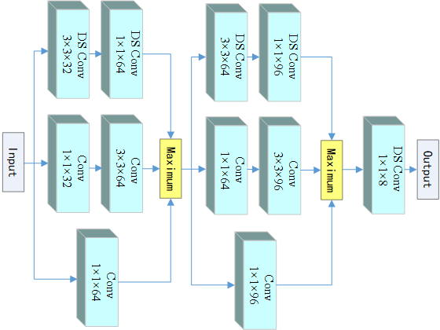

# built-up-area-detection
Several deep learning methods for built-up area detection.

This repo contains the source code for three papers:  
**"Automatic Extraction of Built-Up Areas From Panchromatic and Multispectral Remote Sensing Images Using Double-Stream Deep Convolutional Neural Networks"**,  
**"Multi-branch convolutional neural network for built-up area extraction from remote sensing image"**,  
**"Accurate Detection of Built-Up Areas from High-Resolution Remote Sensing Imagery Using a Fully Convolutional Network"**. 

**Noting：**  The codes are implemented based on Keras that running on top of the machine learning platform TensorFlow. The version of Keras is very old and may be not available now, however, the models structure is simple enough that it can be easily reproduced in frameworks such as PyTorch from model files. 

**Structure of DSCNN:**  ./DoubleStreamCNN/NET/network.py  
**Structure of LMB-CNN:**  ./LMBCNN_and_FCN/NET/mynet.py  
**Structure of LMB-FCN:**  ./DoubleStreamCNN/NET/FCN.py


## About Data
Our datasets were captured by the Gaofen-2 remote sensing satellite, mainly from the areas in China. This  satellite was successfully launched in the Taiyuan Satellite Launch Center on August 19, 2014, which can provide the panchromatic image with 1 m resolution and the multispectral image with 4 m resolution. We collect 662 308 sample pairs from 64 Gaofen-2 panchromatic images and corresponding multispectral images acquired in 32 different provincial-level administrative regions of China. Each panchromatic sample has 64 × 64 pixels, and the corresponding multispectral sample has 16 × 16 pixels.

  
**Fig. 1.** Instances of sample pair. Rows 1, 3, 5 are the panchromatic samples of the built-up area; rows 2, 4, 6 are the corresponding multispectral samples of the built-up area; rows 7, 9, 11 are the panchromatic samples of the non-built-up area; and rows 8, 10, 12 are the corresponding multispectral samples of the non-built-up area.

  
**Fig. 2.** Testing panchromatic image with 10240 × 10240 pixels. The left image is a panchromatic image of Jiangsu province that is located in E119.36°N31.34°, the right top image is the area contained in the red box of the left one, and the right bottom one is ground truth of the left image.


## About DSCNN

**Abstract:** As the central area of human activities, built-up area has been one of the most important objects that are recognized from a remote sensing image. Built-up area in different regions has characteristics as follows: the structure and texture of the built-up
area are complex and diverse; the buildings have multitudinous materials; the vegetation distribution and background around the built-up area are changeable. The existing built-up area detection methods still face the challenge to achieve favorable precision and
generalization ability. In this paper, a double-stream convolutional neural network (DSCNN) model is proposed to extract the built-up area automatically, which can combine the complementary cues of high-resolution panchromatic and multispectral image. Some postprocessing steps are adopted to make the results more reasonable. We manually annotated a large-scale dataset for training and testing DSCNN. Experiments demonstrate that the proposed method has a higher overall accuracy as well as better generalization ability
compared to the state-of-the-art techniques.

  
**Fig. 3.** Workflow of the proposed built-up areas detection approach that based on DSCNN.

  
**Fig. 4.** Structure of DSCNN, where the blue blocks are convolutional layers and the convolution kernel size and output channel are marked.


### Citation
If you find our work useful, please consider citing our work using the bibtex:
```
@article{
  author    = {Yihua Tan and
               Shengzhou Xiong and
               Yansheng Li},
  title     = {Automatic Extraction of Built-Up Areas From Panchromatic and Multispectral
               Remote Sensing Images Using Double-Stream Deep Convolutional Neural
               Networks},
  journal   = {{IEEE} J. Sel. Top. Appl. Earth Obs. Remote. Sens.},
  volume    = {11},
  number    = {11},
  pages     = {3988--4004},
  year      = {2018},
  url       = {https://doi.org/10.1109/JSTARS.2018.2871046},
  doi       = {10.1109/JSTARS.2018.2871046}
}
```


## About LMB-CNN

**Abstract:** Built-up area is one of the most important objects of remote sensing images analysis, therefore extract- ing built-up area from remote sensing image automatically has attracted wide attention. It is common to treat built-up area extraction as image segmentation task. However, it’s hard to devise a handcrafted feature to describe built-up area since it contains many non-built-up elements, such as trees, grasslands, and small ponds. Besides, built-up area corresponds to large size local region without precise boundary in remote sensing image so that the precision of segmentation in pixel level is not reliable. To cope with the problem of built-up area extraction, a segmentation framework based on deep feature learning and graph model is proposed. The segmentation procedure comprises of three steps. Firstly, the image is divided into small patches whose deep features are extracted by the devised lightweight multi-branch convolu- tional neural network (LMB-CNN). Secondly, a patch-wise graph model is constructed according to the learnt features, and then is optimized to segment built-up area with patch-level precision in full frame of remote sensing image. At last, post-processing step is also adopted to make the segmentation result visu- ally intact. The experiments verify that the proposed method shows excellent performance by achieving high overall accuracy over 98.6% on Gaofen-2 remote sensing image data with size of 10,240 ×10,240.

  
**Fig. 5.** The framework of the proposed built-up areas extraction approach. It mainly contains three steps: divide the image to patches and extract the deep features; segment using the constructed graph model; conduct some post-processing.

  
**Fig. 6.** Structure of the proposed LMB-CNN. The size and quantity of convolution kernels are shown in the figure, and batch normalization layers and the activation layers are hidden. The “DS Conv”means depthwise separable convolution and “Conv”means standard convolution.


### Citation
If you find our work useful, please consider citing our work using the bibtex:
```
@article{
  author    = {Yihua Tan and
               Shengzhou Xiong and
               Pei Yan},
  title     = {Multi-branch convolutional neural network for built-up area extraction
               from remote sensing image},
  journal   = {Neurocomputing},
  volume    = {396},
  pages     = {358--374},
  year      = {2020},
  url       = {https://doi.org/10.1016/j.neucom.2018.09.106},
  doi       = {10.1016/j.neucom.2018.09.106}
}
```


## About LMB-FCN

**Abstract:** The analysis of built-up areas has always been a popular research topic for remote sensing applications. However, automatic extraction of built-up areas from a wide range of regions remains challenging. In this article, a fully convolutional network (FCN)–based strategy is proposed to address built-up area extraction. The proposed algorithm can be divided into two main steps. First, divide the remote sensing image into blocks and extract their deep features by a lightweight multi-branch convolutional neural network (LMB-CNN). Second, rearrange the deep features into feature maps that are fed into a well-designed FCN for image segmentation. Our FCN is integrated with multi-branch blocks and outputs multi-channel segmentation masks that are utilized to balance the false alarm and missing alarm. Experiments demonstrate that the overall classification accuracy of the proposed algorithm can achieve 98.75% in the test data set and that it has a faster processing compared with the existing state-of-the-art algorithms.

  
**Fig. 7.** Main framework of the proposed built-up area detection algorithm that based on LMB-FCN.

  
**Fig. 8.** The structure of the FCN model.


### Citation
If you find our work useful, please consider citing our work using the bibtex:
```
@article{
  author    = {Yihua Tan and
               Shengzhou Xiong and
               Zhi li and
               Jinwen Tian and
               Yansheng Li},
  title     = {Accurate Detection of Built-Up Areas from High-Resolution Remote Sensing
               Imagery Using a Fully Convolutional Network},
  journal   = {Photogrammetric Engineering and Remote Sensing},
  volume    = {85},
  number    = {10},
  year      = {2019}
}
```
